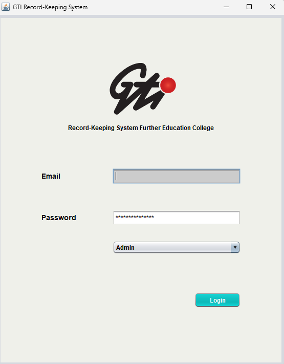
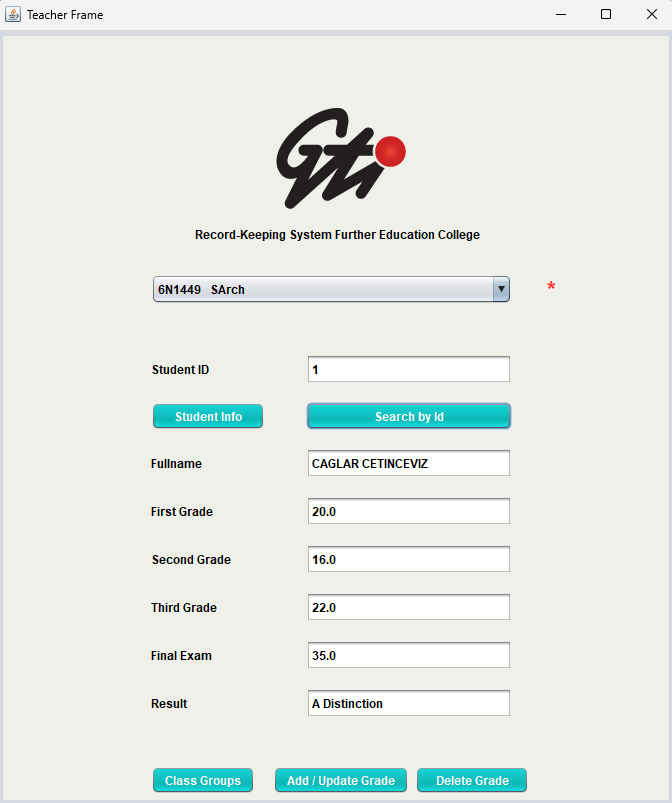
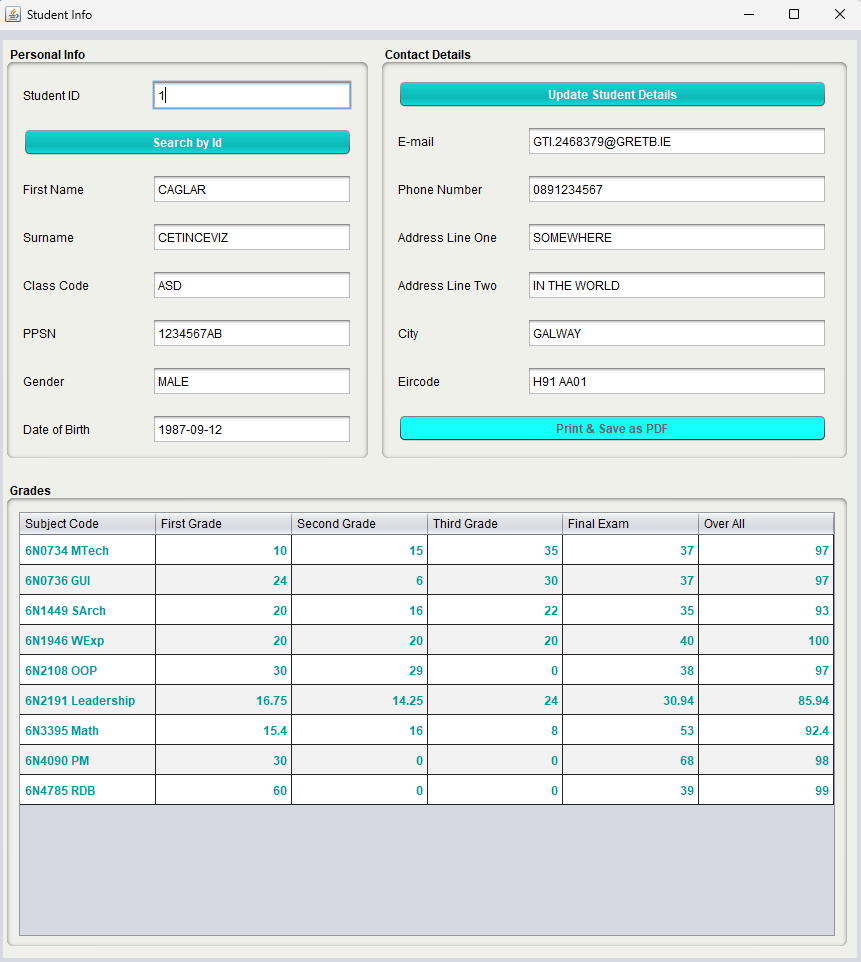
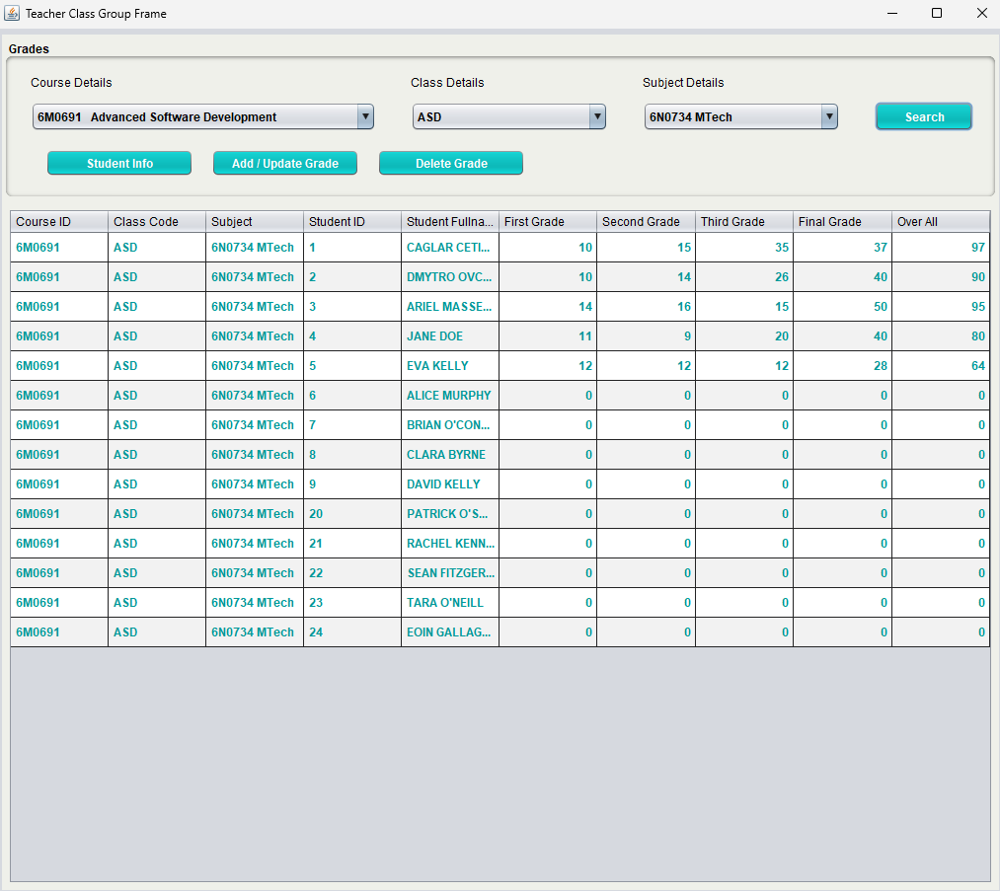
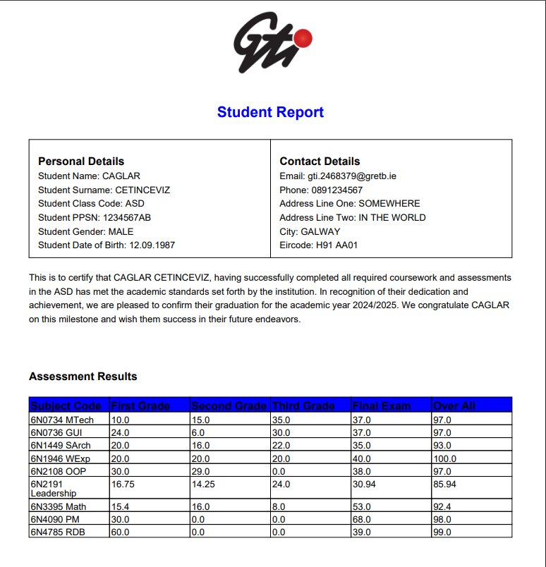

# Record Keeping System

This repo contains my graduation project for GTI Advanced Software Development

**Watch** presentation [video](https://drive.google.com/file/d/1ApvT9w1lkOBx3_hYg8qCZSZCIkDX0XsW/view?usp=sharing).

## Example Screenshots

## Features

* **Secure User Authentication:** Users can log in to access the application.
* **CRUD Functionality:** Easily Create, Read, Update, and Delete student records from the database.
* **Dynamic Data Tables:** View all students in a clear, sortable table.
* **Search Functionality:** Quickly find specific students by name or other criteria.
* **Certification:** Save & print student graduation certificate.

## Tech Stack

* **Backend:** Java, NetBeans
* **Frontend:** Java Swing
* **Database:** MySQL (Hosted on AWS RDS)
* **Version Control:** Git / GitHub

## Challenges & Lessons Learned

"A key challenge was integrating the combo boxes. The first system that I built overlapped with some functions; then I overcame this by creating static variables and printing them after each action in the system screen. This was a breakthrough, allowing me to master the learn how to handle the bugs."

## Login Options
To log in as an admin, please use the email address **_bigboss@gretb.ie_** and the password **_admin123_**.

To log in as a teacher, please use the email address **_johndoe@gretb.ie_** and the password **_john123_**.

